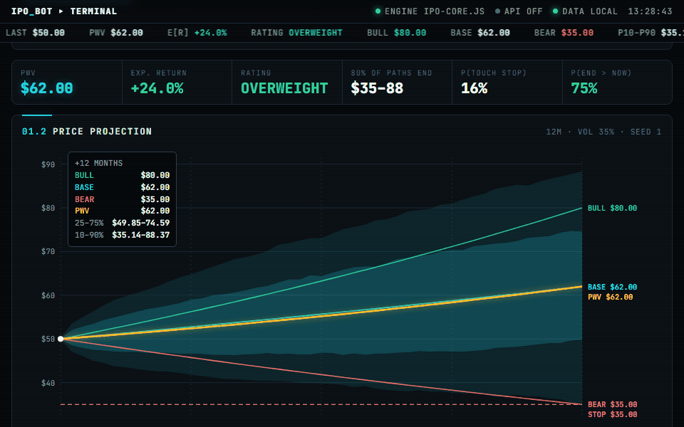

# IPO bot

[](https://github.com/luke-zhang-cs-py/ipo-bot/actions/workflows/tests.yml)
[](https://www.python.org/)
[](https://docs.anthropic.com/)

IPO and stock research on Claude that answers in one page, then lets code **check every number in it**.

### ▶ [Project a stock, size a trade, check a memo →](https://luke-zhang-cs-py.github.io/ipo-bot/app/)
Runs in your browser: every NYSE ticker the SEC lists, searchable by ticker, company or sector; a memo's bull, base
and bear cases drawn as a price projection (2,000 simulated paths that average out at the probability-weighted value);
a table of trade ideas you can sort by expected return, reward to risk, chance of hitting the stop or shares allowed;
and the bot's own sizing rules and memo checks, ported from the Python and tested against it. No API key, nothing uploaded.



**[Read the write-up →](https://luke-zhang-cs-py.github.io/ipo-bot/)** — what a memo contains, why its numbers can be
trusted, and what an honest benchmark found.

## How it works

```
question -> Claude + tools (SEC EDGAR, XBRL, FRED, market data, web, calculator) -> one-page memo -> KEY NUMBERS -> verify.py
```

- **The memo:** a rating, bull, base and bear scenarios that add up to 100%, a probability-weighted value, a
  *stop-working price*, dated catalysts and sources. An IPO gets two ratings: at the offer and in the aftermarket.
- **11 accuracy checks** run before every answer: identity, freshness, reconciliation, periods and units, outliers, the
  primary filing, scenario consistency, citations, and "unknown" instead of a guess.
- **KEY NUMBERS:** every memo ends with a JSON block that `verify.py` recomputes: market cap, EV, multiples, the
  scenario maths and the rating thresholds. A second model call (`audit.py`) audits the memo against its sources.
- **Portfolio mode:** with your holdings and rules loaded, it decides buy, add, hold, trim or sell, but the size comes
  from the smallest of the limits in your own file: risk per trade, position, sector and cash, plus optional guardrails
  (order value, gross exposure, daily loss, drawdown, earnings blackout, volume, a kill switch).
- **Execution and monitoring:** limit orders with partial fills worked safely, a monitor that stops on API failures,
  stale quotes, wide spreads or a price that ran, and paper trading with a signal-to-execution report
  ([`docs/BOT_SPEC.md`](docs/BOT_SPEC.md)).

## The keyless bot

`python -m bot update` runs on a fresh clone with no keys. It collects S&P 500 prices, Treasury yields, the
VIX and the IPO pipeline from keyless sources, each behind an adapter with a fallback. It checks the data,
predicts next-day direction for every member and first-day pops for IPOs before they list, scores those
predictions when they resolve, and writes a health report. Storage is SQLite and point-in-time: every row has
`available_at`, first releases are kept, and history can't be overwritten. The schedule is in GitHub Actions:
daily after the close, EDGAR every 3 hours, a weekly walk-forward backtest with Diebold-Mariano tests against
baselines, and a monthly retrain that is adopted only if it does better. The tests run offline at 100% line and
branch coverage. Details: [`bot/README.md`](bot/README.md); latest reports: [`reports/`](reports/).

## What the evaluation found

The model knows how past years turned out, so it is scored forward: each rating is logged with its price and
scenarios (`src/track.py`). To give it a bar to clear, seven simple prediction algorithms were tested every month from 2009
on 30 US large caps, 15 country ETFs and the 9 US sector ETFs, each seeing only the prices known that day.

| Test | Result |
|---|---|
| 36 algorithm-universe-horizon tests, permutation p-values, false-discovery rate 10% | 4 pass a naive 5% bar; **0 of 36** survive |
| Picked on 2009-2017, checked from 2018 | 1 of 5 held up |
| 12-month 80% ranges, 18 algorithm-universe pairs | held the outcome only 70.0% to 77.4% of the time |
| Chosen on 2018-2023, tested once from 2024 (recorded, not re-run) | 0 of 1 held up: rank IC +0.064 (p = 0.027) became -0.033 (p = 0.518) |
| Five beginner bots, 2005-2026, 0.30% a round trip, against holding SPY (+10.94% a year) | DCA +0.01, rebalancing 60/40 -2.69, trend 50/200 -2.28 (fragile: +0.80 in 2005-2015, -5.25 after), mean reversion -8.36, grid -8.73 points a year |
| The keyless bot, next-day direction of S&P 500 members, walk-forward 2017-2026 (1,196,771 predictions) | Brier 0.2503 against 0.2496 for each stock's base rate and 0.2500 for a coin flip: no edge (DM p = 0.19 after Holm) |
| A pre-listing IPO model, walk-forward 2018-2023 (696 test IPOs) | PR-AUC 0.683 (95% CI 0.625 to 0.734) against a 0.407 base rate, p < 0.001; 2022-23 only 0.377 (0.199 to 0.557) against 0.205; bought at the open, its top fifth makes +0.80% on day 1 against +3.44% for every IPO |
| Paper bot replayed over 2026 on real prices, every guardrail on | +10.71% against SPY's +13.77%, beta 0.339 (95% CI 0.247 to 0.423); 33 of 86 signals (38.4%) stopped by the price-deviation guard ([`tracking/`](tracking/)) |

Simple price signals give no 12-month edge that holds up, and ranges drawn from history are too narrow; both findings
went back into the prompt. Every backtest fills at the next open, charges costs, and is re-run at 1.5x and 2x costs,
with late fills, nudged parameters and by market regime; look-ahead and warm-up checks, volume-share slippage and
split-adjusted prices follow freqtrade, zipline and LEAN (re-implemented, see the spec). Details: [`evaluation/`](evaluation/).

## Run it

```bash
pip install -r requirements.txt
python src/ipo_bot.py "Rate the <company> IPO"          # needs ANTHROPIC_API_KEY; data keys in .env.example
python src/ipo_bot.py --portfolio portfolio.json         # review your holdings by your own rules
python src/ipo_bot.py --audit "Rate <ticker>"            # plus a second-pass audit
python src/paper.py run signals.json --portfolio portfolio.json [--alpaca]   # paper trading; then: report
python evaluation/strategies.py                          # the five bots and their stress tests
python evaluation/ipo_data.py && python evaluation/ipo_eval.py   # the IPO dataset (about an hour) and its checks
python evaluation/tracker.py                             # the paper bot against the market this year: tracking/
```

## Tests

```bash
python -m pytest -q tests                  # 286 offline tests, free: 174 for the research bot (10 need Node: the
                                           # browser demo against the Python) and 112 for the keyless bot
IPO_BOT_LIVE=1 python -m pytest -q tests/test_live_market.py   # 15 live checks on real SEC filings and prices
python -m pytest -q tests/bot --cov=bot    # the keyless bot: offline, no keys, 100% line and branch coverage
python testkit/kit.py regress --yes        # the test kit, live: calculation cases, hallucination traps, a tools-off
                                           # stale-data test, rule tests; costs API credit
```

The test kit (`testkit/`) also has a golden-set template, a consistency test, and a no-hindsight IPO
backtest that cuts the data tools off at the day before pricing.

## Layout

```
bot/          the keyless prediction bot (python -m bot): adapters, store, checks, models, backtest, tracking
reports/      its latest health and backtest reports (tracking/bot/ holds its prediction ledgers)
src/          the bot (ipo_bot.py), data tools, portfolio sizing, checks, verify, audit, ledger, execution, monitor, paper
prompts/      the system and auditor prompts
evaluation/   benchmark, calibration, robustness, backtest suite, trading bots, IPO dataset and evaluation, stress test
testkit/      the test kit (kit.py) and its cases
tests/        the pytest suite
docs/         the write-up, the browser demo (GitHub Pages) and the trading spec
tracking/     the running check of the paper bot against the market
scripts/      rebuilds the NYSE list from SEC data, re-records the demo GIF
```

## Limits

- No live run is recorded: every live test needs an API key and costs credit.
- The stock universes are today's survivors, which flatters long-only results; the sector ETFs are the survivor-free check.
  The IPO dataset has the same problem: Yahoo keeps no prices for delisted companies, so coverage is reported by year.
- Paper trading is replayed on real daily prices with a simulated order book; a live forward test needs a free Alpaca
  paper account. The IPO holdout (2024 on) is still sealed.
- Views on securities, not personal advice; every answer ends with that disclaimer. Before anyone else uses it, ask a
  securities lawyer about adviser registration (including Massachusetts) and your data licences.
